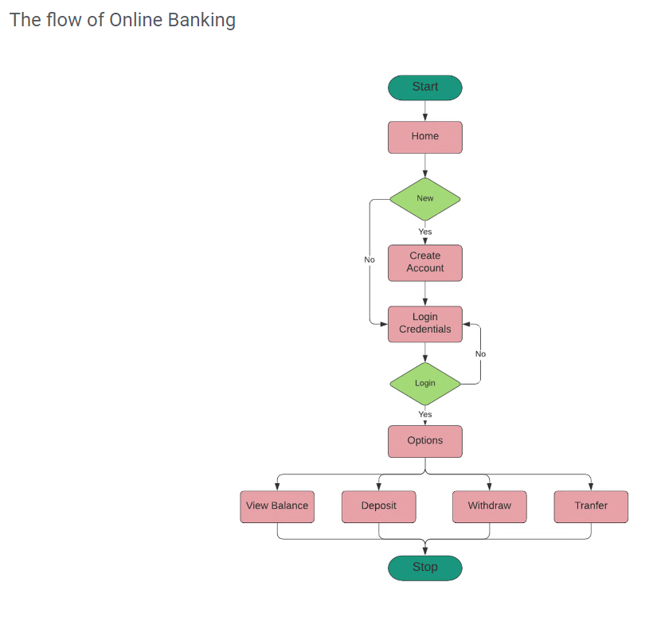

# mybanking
my online banking app 

Description:

Online Banking has changed the way banks usually function. 
It bought most of the time-consuming procedures like money transfer, RTGS, NEFT to account holders' fingertips. 
Most of the national and multinational banks use internet banking these days.

Online Banking System is a model - Banking Site. T
his site helps customers to perform bank transactions through a phone or laptop. 
The project would be performing the following operations.

Home page of the Online Banking site
Creation of the new accounts
Login, Logout
Manage Profile and Password
View the balance of the account
Deposit the amount
Withdraw amount
Transfer the amount
Close account

The flow of Online Banking:
